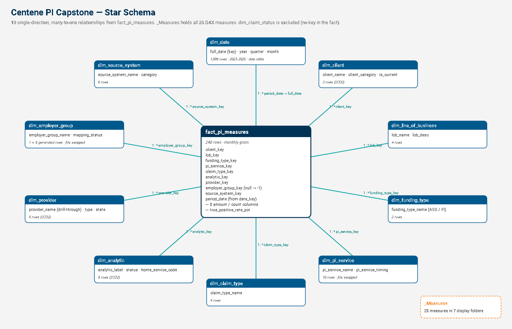

# Centene Payment Integrity – Capstone (capstone-healthcare)

A Power BI report for Centene's Payment Integrity (PI) programme. It answers three questions a PI leader asks every month:

1. **How much did we save, and is it growing?** → *Executive Overview*
2. **Which services and analytics deliver the savings, and how accurate are they?** → *Service & Analytic Performance*
3. **What is happening with one specific provider?** → *Provider Detail* (drill-through)

Everything in this folder is plain text (Power BI Project format, `.pbip`), so it can be version-controlled, diffed and reviewed in Git.

---

## 1. What is in the package

| Item | File | Acceptance criterion it covers |
|---|---|---|
| Power BI report + model | `Centene_PI_Capstone.pbip` (opens the `.Report` and `.SemanticModel` folders) | 3 pages, ≥ 8 measures, ≥ 3 slicers, drill-down + drill-through |
| Validation sheet | `docs/Validation_Sheet.xlsx` | 24 reconciliation tests (≥ 10 required), all PASS |
| KPI dictionary | `docs/KPI_Dictionary.md` | Definition, DAX and format of all 28 measures |
| Model diagram | `docs/Model_Diagram.png` (+ `.svg`) | Star schema picture |
| Claude prompt log | `docs/Prompt_Log.md` | Prompts used + validation performed |
| Demo script | `docs/Demo_Script.md` | 10-minute demo + 5-minute Q&A preparation |
| Theme | `docs/Centene_Theme.json` (already embedded in the report) | Centene brand colours taken from centene.com |
| Data profiling notes | `docs/Dataset_Check.md` | Data-quality findings |
| Screenshots | `docs/screenshots/*.png` | Evidence of the working report |

## 2. How to open it

1. Open **`Centene_PI_Capstone.pbip`** in Power BI Desktop (any build from 2025 or later).
2. A yellow bar says *"Some of the tables have incomplete or no data"*. Click **Refresh now**. (A `.pbip` stores the model definition, not the data, so the first open always needs a refresh.)
3. If the CSVs are somewhere else: **Transform data → Edit parameters → `DataFolder`**, and set the folder that contains the 12 CSVs, ending with `\`.
   Default: `C:\Users\azureuser\Documents\powerbi-accelerator\day9\centene-data\`
4. Optional: **File → Save** writes a local data cache, so later opens show data immediately.

---

## 3. The data

12 CSV extracts in `day9/centene-data`:

* **1 fact table**: `fact_pi_measures`, 248 rows, one row per client × LOB × funding type × PI service × claim type × analytic × provider × employer group × source system × **month** (Jan-2023 to Dec-2025).
* **11 dimensions**: date, client, line of business, funding type, PI service, employer group, claim type, analytic, provider, source system, claim status.

### Business vocabulary

| Term | Meaning |
|---|---|
| **Payment Integrity (PI)** | Making sure claims are paid correctly: the right amount, to the right provider, by the right payer. |
| **Pre-pay savings** | Money *never paid out* because a claim was stopped or corrected before payment (claim edits, prepay clinical review). This is the cheapest kind of saving. |
| **Post-pay savings** | Money *recovered* after a claim was overpaid (DRG validation, itemised bill review, subrogation, credit balances). |
| **True positive rate (TPR)** | Of the claims an analytic flagged, the share that really were wrong. High TPR means less provider abrasion and less wasted review effort. |
| **ASO vs Fully Insured** | ASO: the employer funds claims and Centene only administers them. FI: Centene carries the risk. |
| **SCD2** | "Slowly changing dimension type 2": history rows are kept with effective and expiration dates (e.g. Sunrise Rehab re-registered as an LLC in 2024). |

### Data-quality issues found, and how the model handles them

| # | Issue | Fix (in Power Query, so it reruns on every refresh) |
|---|---|---|
| 1 | `dim_employer_group.csv` and `dim_pi_service.csv` have **swapped contents** | Each table is loaded from the other file name |
| 2 | Fact `date_key` is `YYYYMMDD` (20250401), but `dim_date.date_key` is a 1…2557 surrogate, so a key join would match **nothing** | `period_date` is derived from `date_key` and related to `dim_date[full_date]` |
| 3 | **124 fact rows** (50%) have a null employer group | Null → `-1` → member "Not Assigned" |
| 4 | **50 fact rows** point to employer groups 2–6, which do not exist | Power Query compares fact keys with the dimension and appends "Unmapped Group (key n)" rows automatically |
| 5 | Employer group 1 belongs to client 2, but 9 rows pair it with client 1; HealthFirst (ASO) has 57 rows marked FI | Reported, not changed (it needs a source-system fix) |
| 6 | `total_claims_*_amount` columns are whole numbers | Treated and labelled as **claim counts** |
| 7 | `dim_claim_status` has no key in the fact | Not loaded (it cannot be related) |
| 8 | Calendar runs 2022–2028, but facts only cover 2023–2025 | Calendar trimmed to 2023–2025 so slicers show real periods only |
| 9 | `true_positive_rate_pct` is a percentage | Always averaged, never summed |

---

## 4. The model (star schema)



* **One fact, ten dimensions.** Every relationship is **many-to-one and single-direction** (filters flow from dimension to fact only). This is the simplest, fastest and least ambiguous design.
* **`dim_date` is marked as the date table** (key `full_date`). That makes `TOTALYTD` and `SAMEPERIODLASTYEAR` work. Auto date/time is switched off, so there are no hidden `LocalDateTable_*` tables.
* **`_Measures`** is an empty table that only holds measures, organised in 7 display folders.
* All key and raw numeric columns are **hidden**, so report authors use measures and cannot accidentally *sum* a rate.
* **`DataFolder` parameter**: one place to repoint all 11 queries.

---

## 5. The measures (28 – full list in `docs/KPI_Dictionary.md`)

| Folder | Measures | How to explain them |
|---|---|---|
| Savings | Total Savings, Pre-Pay Savings, Post-Pay Savings, Pre-Pay Share %, Savings Rate %, Savings per Processed Claim, Savings YTD | Base measures are `SUM`s. Ratios use `DIVIDE`, which returns blank instead of an error when the denominator is 0. |
| Claims & Payments | Total Billed, Total Paid, Paid to Billed %, Claims Submitted, Claims Pre-Edit Allowed, Claims Processed, Pre-Edit Reduction %, Processing Yield % | The claims funnel: submitted → passed edits → processed. |
| Accuracy | Avg True Positive Rate %, Savings-Weighted TPR % | The weighted version uses `SUMX` to multiply each row's TPR by its savings, so big findings count more. |
| Time Intelligence | Total Savings PY, Savings YoY %, Latest Year YoY % | See below. |
| Provider | Provider Savings Rank, Providers with Savings | See below. |
| Data Quality | Fact Row Count, Rows Without Employer Group, Rows With Orphan Employer Group, Savings Reconciliation Gap | These measures prove the data is complete. The gap must be $0. |
| Labels | Provider Page Title, Data Range Label | Dynamic text. |

### The four measures you must be able to explain out loud

**Savings YoY %**
```DAX
VAR Curr = [Total Savings]
VAR Prev = [Total Savings PY]          -- CALCULATE([Total Savings], SAMEPERIODLASTYEAR(dim_date[full_date]))
RETURN IF(NOT ISBLANK(Prev), DIVIDE(Curr - Prev, Prev))
```
*"I store this period's and last year's savings in variables. `SAMEPERIODLASTYEAR` shifts the date filter back 12 months. If there is no prior year (2023), I return blank rather than a misleading 100%."*

**Latest Year YoY %** (KPI card)
```DAX
VAR LastYear = YEAR(MAX(fact_pi_measures[period_date]))
VAR Curr = CALCULATE([Total Savings], dim_date[year] = LastYear)
VAR Prev = CALCULATE([Total Savings], dim_date[year] = LastYear - 1)
RETURN IF(NOT ISBLANK(Prev), DIVIDE(Curr - Prev, Prev))
```
*"On a card with no year selected, a normal YoY would compare all three years with a shifted window, which is meaningless. So the card finds the latest year that has data (2025) and compares it with the year before (2024): +23.3%."*

**Provider Savings Rank**
```DAX
IF(
    ISINSCOPE(dim_provider[provider_name]) && NOT ISBLANK([Total Savings]),
    RANKX(ALLSELECTED(dim_provider), [Total Savings], , DESC, Dense)
)
```
*"`ISINSCOPE` limits the rank to provider rows, so the total row stays blank. `ALLSELECTED(dim_provider)` ranks against every provider the slicers allow. I use the whole table, not just the name column, because the leaderboard also shows type and state. Ranking over the name column alone would leave those filters on and every row would rank 1."*

**Savings-Weighted TPR %**
```DAX
DIVIDE(SUMX(fact_pi_measures, fact_pi_measures[true_positive_rate_pct] * fact_pi_measures[total_savings_amount]), [Total Savings]) / 100
```
*"`SUMX` goes row by row, multiplies the rate by that row's dollars and adds them up. Dividing by total dollars gives the dollar-weighted average accuracy."*

---

## 6. The report (exactly 3 pages)

Common layout on every page:
* **Centene-blue navigation rail** (`#00598C`) with **4 synced slicers**: Year, Client, Line of Business, Funding Type. A selection made on one page carries over to the others.
* **Reset filters button** under the slicers (Power BI's built-in *Clear all slicers* action). One click clears Year, Client, Line of Business and Funding Type, and because the slicers are synced, every page resets.
* **White header bar** with the page title in Centene blue, the page question in grey, and a thin blue underline.
* **6 KPI cards**, then 4 visuals.

| Page | Visuals | Interactivity |
|---|---|---|
| **1 · Executive Overview** | Cards: Total / Pre-Pay / Post-Pay Savings, Savings Rate %, Avg TPR %, Latest Year YoY %. Combo chart (stacked pre/post columns + Savings Rate % line). Donut by LOB. Bar by claim type. Provider leaderboard with rank. | **Drill-down** Year → Quarter → Month on the combo chart. **Drill-through** from the leaderboard to page 3. |
| **2 · Service & Analytic Performance** | Cards: Billed, Paid, Paid-to-Billed %, Claims Submitted, Pre-Edit Reduction %, Weighted TPR %. Matrix Timing → Service → Analytic. Bar by service. Claims-funnel column chart. Analytic scorecard. | **Drill-down** in the matrix (+/–) and in the funnel chart (Year → Quarter → Month). |
| **3 · Provider Detail** | Dynamic title, 6 provider cards, savings vs prior-year line, savings by service, claim-line detail table. | **Drill-through target** on `dim_provider[provider_name]`, with a Back button. |

Screenshots: `docs/screenshots/`.

### Theme (from centene.com)
Extracted from the live CSS at centene.com (`--brand-color-global` variables): primary blue `#00598C`, navy `#003356`, teal `#00A0A4`, text grey `#58595B`, and accents orange `#F58220`, purple `#5C2F92`, magenta `#CB187D`, green `#2C8641`. Pre-pay is always blue and post-pay always teal, across every page.

### Design system: matched to centene.com (colours, fonts, tiles, tables)
Both the colours and the fonts were taken from the live CSS at centene.com. The site uses **Centene blue `#00598C`** for its navigation dropdowns, footer and "navy" content blocks, always with white text. Its header is white, and its light sections are grey (`#DCDDDE` / `#F4F4F4`). Its headings use the **Roboto** family: `centene-h1` is Roboto Light, `centene-h2`/`h3` are Roboto Regular, `centene-h5` labels are Roboto Bold in capitals, and buttons and tabs are Roboto Medium. Power BI does not embed fonts, so every font in the report has a **Segoe UI fallback**: a viewer who does not have Roboto installed still sees a clean report.

| Element | Font (as on centene.com) | Colour |
|---|---|---|
| Page titles, provider page title | **Roboto** Regular, 16 pt (site h2/h3) | Centene blue `#00598C` |
| CENTENE logo, "PAYMENT INTEGRITY ANALYTICS", TIP label | **Roboto Bold**, capitals (site h5) | White / light brand `#DFF7F7` on the blue rail |
| Visual titles, slicer labels, Back button | **Roboto Medium** (site buttons and tabs) | Navy `#003356` / blue |
| KPI numbers | **Roboto Light**, 26 pt (site h1) | Centene blue `#00598C` |
| Body text, axis labels, legends, table rows | **Roboto** | Grey `#333333` / `#58595B` |

* **Page:** centene.com section grey (`#F4F4F4`).
* **Navigation rail:** Centene blue (`#00598C`), like the site's nav and footer, with white text and white slicer boxes.
* **Back button:** the site's `white-btn` style: white fill, Centene-blue text and icon.
* **Header:** white bar (like the site header) with a 2 px blue underline. A light-blue (`#E5F5FF`) "Data: Jan 2023 – Dec 2025" pill is driven by the `Data Range Label` measure.
* **Tiles:** every visual is a flat white card with 4 px corners, a hairline border (`#DCDDDE`, the site's border grey), **no drop shadow**, and a divider line under the title.
* **KPI cards:** no accent bars, just a small grey label and a large, thin number with one decimal ($156.8M, $6.3bn).
* **Tables and matrix:** **Centene-blue header row with white Roboto Medium text** (like the site's blue content blocks); alternating white / near-white (`#FAFAFA`) rows; horizontal hairlines only; a navy total row on the site's light-grey band (`#DCDDDE`); **teal in-cell data bars** on Total Savings.
* **Charts:** legend on top, no axis titles, dotted light gridlines, 3 px lines with markers, value labels in $M on bar charts, and percentage labels on the donut.
* **Tooltips:** every tooltip is Centene-styled through the theme: navy background (`#003356`), light-teal labels (`#DFF7F7`), white values, Roboto text and teal drill actions. Each chart also shows extra context on hover: for example, the savings trend adds Pre-Pay Share %, Avg TPR % and Savings YoY %, and the claims funnel adds Pre-Edit Reduction %, Processing Yield % and Savings per Processed Claim.

---

## 7. Key numbers (all reconciled – see `docs/Validation_Sheet.xlsx`)

| KPI | Value |
|---|---|
| Total Savings | **$156,764,903.24** (pre-pay $69.7M + post-pay $87.0M) |
| Savings Rate (of billed) | **2.48%** |
| Avg True Positive Rate | **64.2%** |
| Savings by year | 2023 $58.0M → 2024 $44.2M (−23.8%) → 2025 $54.5M (**+23.3%**) |
| Top PI service | Coordination of Benefits – $26.5M |
| Top provider | Sunrise Rehabilitation Hospital LLC – $29.86M, just ahead of Riverside Medical Group ($29.84M) |
| Biggest LOB | Medicare – $47.3M (30.2%); Commercial is $39.1M (25.0%) |

### How validation was done
1. **Expected values** were computed in Node.js **directly from the CSVs**, without Power BI.
2. **Actual values** came from DAX queries run against the live Power BI Desktop model after refresh.
3. The two were compared with a tolerance of $0.01 for money and 0.0001% for rates. **24 of 24 tests pass.**

---

## 8. Acceptance-criteria checklist

| Criterion | Status |
|---|---|
| Exactly 3 pages | ✅ Executive Overview, Service & Analytic Performance, Provider Detail |
| ≥ 8 DAX measures | ✅ 28 |
| ≥ 3 slicers | ✅ 4, synced across all pages |
| ≥ 1 drill-down or drill-through, tested | ✅ Drill-through tested in Power BI Desktop (Riverside → $29.8M). Drill-down hierarchies Year → Quarter → Month and Timing → Service → Analytic are built in. |
| Validation sheet with 10 tests, all primary KPIs reconcile | ✅ 24 tests, 24 PASS |
| Model diagram + KPI dictionary | ✅ `docs/` |
| Claude prompt log | ✅ `docs/Prompt_Log.md` |
| 10-minute demo + Q&A | 📋 Script in `docs/Demo_Script.md`. Rehearsal is up to you. |
